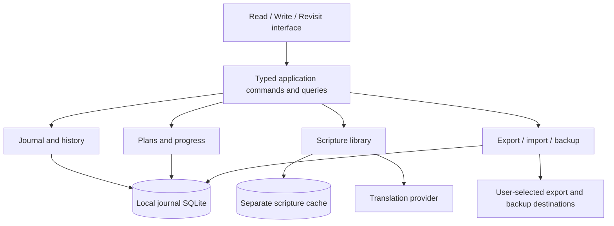

# Architecture proposal

Status: proposed implementation architecture. Confirmed product requirements are
in [PRODUCT.md](PRODUCT.md). This document does not authorize a feature beyond
that scope. The journal database as authority and one-way Obsidian export are
settled directions; the stack and detailed policies below are recommendations.

## Application shape

One locally installed application, with a React/TypeScript interface, a Tauri 2
shell, and a SQLite journal managed by a Rust application service. No server,
account, network synchronization, or public plugin framework in the first release.
Markdown is the canonical body representation inside the database. Exported
Markdown is a generated view, not a second authority.

The interface sends typed commands such as `saveDraft`, `finishEntry`,
`restoreRevision`, `completeReading`, and `exportChanges`. Native services validate
commands and perform transactions. Do not expose unrestricted SQL or arbitrary
filesystem paths to the webview. Query responses are typed read models; React
components do not assemble SQL or know table names.

## Module ownership

| Module | Owns | Must not own |
|---|---|---|
| Scripture | Canonical passage references, translation providers, validated text, offline downloads | Plan progress, entry lifetime |
| Journal | Entry identities, revisions, drafts, tags, passage associations, outgoing links, backlinks | Provider HTML, exported filenames |
| Plans | Versioned definitions, enrollment, assignments, completion history | Reader navigation, journal storage |
| Portability | Export manifests/jobs, import provenance, backups and restore | Independent editorial authority |
| Platform | Database access, file grants, lifecycle, dialogs, packaging | Reading-plan semantics |
| Interface | Navigation, scroll anchor, composition, accessible presentation | Persistence invariants implemented only in hooks |

Boundaries are internal modules and interfaces, not separately deployed services.
Use adapters at actual outside boundaries. Avoid a generalized event-sourcing
framework, speculative plugins, or implementing a sync protocol in advance.

## Technology recommendation and validation

Tauri retains the existing project's useful desktop knowledge and has mobile
targets. React/TypeScript retains reusable passage and plan logic. Rust owns
atomic persistence and filesystem operations; a SQLite binding should expose
transactions and the backup API directly. Select and pin the concrete binding
after the persistence spike; `rusqlite` is a candidate, not a settled dependency.

The official Tauri SQL plugin is an alternative, but generic webview SQL is not
the proposed public application boundary. A service can own database access
regardless of the selected binding. [Tauri SQL documentation](https://v2.tauri.app/plugin/sql/)

Tauri uses system webviews, so Chromium-only browser tests are insufficient proof
of desktop behavior. Verify the editor, text selection, continuous scroll,
IME input, and composition persistence on actual Linux WebKitGTK and Apple
Silicon macOS. macOS/iOS builds require Apple's toolchain; Linux checks do not
establish iOS readiness. [Tauri prerequisites](https://v2.tauri.app/start/prerequisites/)

Select the rich-text editor only after testing Markdown round trips, internal
entry links, paste sanitization, keyboard navigation, and draft recovery. Keep
editor-specific JSON disposable so journal meaning survives editor replacement.
The existing Milkdown integration is a candidate, not a requirement. There is
no reason to change UI frameworks merely to make the repository new.

## Persistence and application state

Use one private local journal database per local journal. Collections and stable
IDs leave room for future ownership; do not equate a device ID with a user.
Profile switching, authentication, and shared-device UI are not release promises.
See [DATA-MODEL.md](DATA-MODEL.md) for revision and transaction rules.

All durable journal/progress/preferences state belongs in the application store;
do not use localStorage as the only copy of user data. Search and backlink query
indexes are reconstructible from canonical records. Use SQLite full-text search
if the selected binding/build supports it; prove availability in the spike.
Schema migrations are ordered and tested against supported prior snapshots.

Run serialized write commands off the UI thread, with explicit cancellation and
visible failures. A transaction acknowledges the exact draft generation saved.
The UI may optimistically display typed text, but says Saved only after commit.
Prefer a single writable app instance per journal in the initial implementation.

Keep scripture downloads in a separate disposable store so clearing or repairing
the cache cannot affect entries or revisions. A download is complete only when
all expected chapters are validated and persisted. Cancellation is distinct from
success; refresh bypasses cached content. Partial downloads can resume.

## Passage and reading semantics

Use stable book identifiers and structured chapter/verse bounds with a reference
scheme identifier. Display names and API book numbers belong to adapters.
Support several passage associations per entry and entries with none. Retain the
translation of captured quotations/context; do not claim all editions share
identical verse numbering. Existing 66-book Protestant data is a proposed first
reference scheme, not a universal model of every Bible tradition.

Reader location, plan assignment, completion, and draft associations are separate
state. Scroll-based location changes never rewrite a draft or mark readings done.
Keep a verse-based scroll anchor while loading, resizing, and changing translation.
Render a bounded window of chapters with preserved height/anchors so long reading
sessions do not accumulate an unbounded DOM. Test both directions and short chapters.

Plan definitions are immutable/versioned; enrollment identifies the chosen
version and progression policy. Completion records identify the actual assignment
and passages, not merely a mutable day index. Editing a plan requires explicit
adoption for an existing enrollment. A calendar schedule and independent chapter
streams need different progression policies, not special cases in reader code.

Proposed plan records are `plan_definitions` (identity), `plan_versions` (validated
schema/versioned content), `enrollments` (selected version, starting positions and
progression policy), and `reading_completions` (stable assignment identity, stream,
passage snapshot, local reading date and completion time). Undo is explicit and
must not rewrite the original definition. Template definitions carry identity and
schema version; the starter template produces blank ordinary Markdown. Imported
plans/templates are validated data, never executable code.

## Trust, privacy, and future network boundaries

Treat API text, imported Markdown, YAML, links, and export destinations as
untrusted input. Sanitize allowed markup or render structured text; prohibit
executable raw HTML. Apply a content security policy and narrow native commands
to application data and explicitly selected locations. Validate paths, symlinks,
archive members, sizes, schemas, and link protocols at the native boundary.

Do not log journal bodies or put real journals in test fixtures. Backups and
exports contain private plaintext unless an explicit encryption feature is later
implemented; local SQLite alone is not encryption. No analytics or remote journal
transmission is required for this version.

Stable entity/revision/operation IDs and transactional change records support
future work, but a local change log is not a sync engine. Future sync must handle
conflicting branches, device enrollment, deletion propagation, recovery, and
sharing authorization. Linking an entry never grants access to its target.
Future E2EE needs a separate threat model/key-recovery design; no placeholder
cryptography or promise of a one-switch upgrade. Do not synchronize a live SQLite
file through a folder synchronization service.

## Validation and delivery shape

The first runnable slice demonstrates: open scripture, scroll past an assigned
range, write offline, restart and recover, finish an entry, inspect/restore a
revision, link two entries, and export updated Markdown without breaking links.
It contains no sync demonstration because sync is explicitly deferred.

Use pure passage/plan tests, real SQLite transaction and migration tests,
filesystem failure-injection tests, browser interaction tests, and native smoke
tests. Mock network content with small synthetic fixtures. Include crash points,
out-of-order saves, full disk/write failures, damaged imports, and external edits
to exports. Measure export on 20,000 synthetic entries with three changes, long
reader sessions, and growing revision history; establish timings from measurement
rather than inventing performance guarantees.

Prove Linux and macOS packaging early. A build in CI is useful but does not replace
testing on the actual Arch laptop and M2 MacBook. Signing/notarization and updater
policy need their own distribution decision. Mobile layouts and capability
adapters remain considered; mobile release validation is future work.

Before shipping downloaded or bundled translations, verify provider availability,
attribution, and permitted offline/distribution use for each requested edition.
The old app's API access does not establish those permissions. Track that research
in Beads; keep scripture text out of this repository until it is resolved.

Implementation order, owners, and acceptance status live in Beads. Documents
remain specifications and decision records rather than duplicate task lists.
